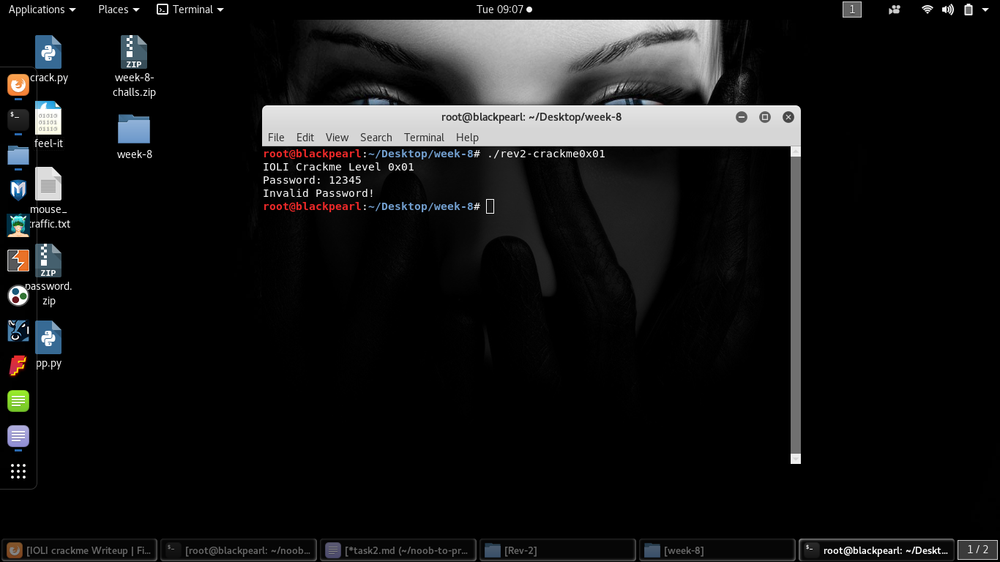
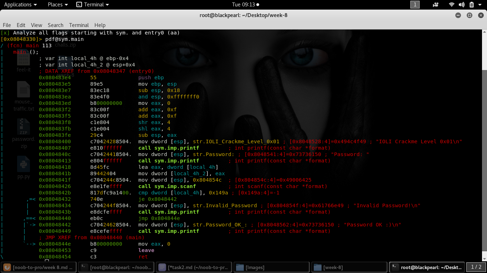
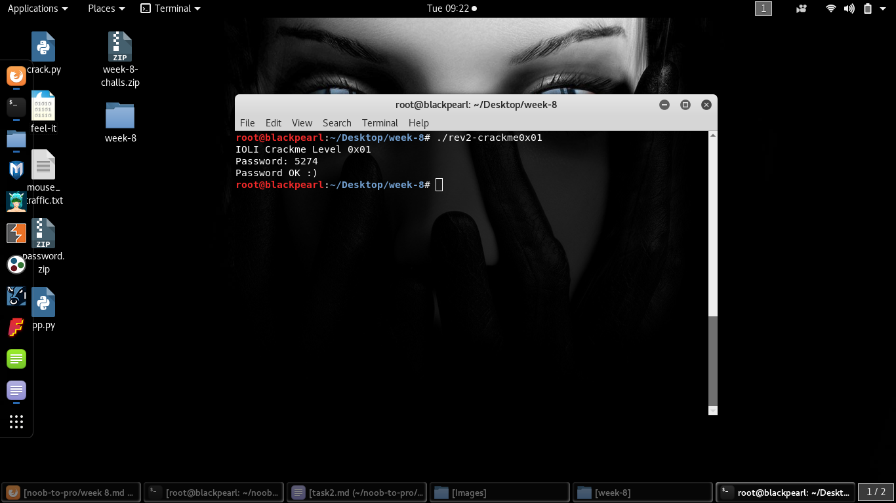

# Rev-2

## The Challenge

Here's the challenge task from the reversing category.We have to find the correct password and check if ok then password is our flag.

Now let's see the code of file using radare2.Make sure that file is executable.

      aa tells radare2 to analyse the whole binary.
      pdf is short of Print Disassemble Function.

Now after analysis of code line by line i found cmp instruction with a constant 0x149a at 0x0804842b.

I think may be the password for this challenge is `0x149a`.
So, i tried it after converting it in to decimal form(`5274`).

