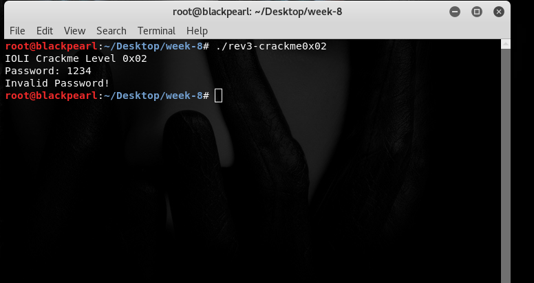
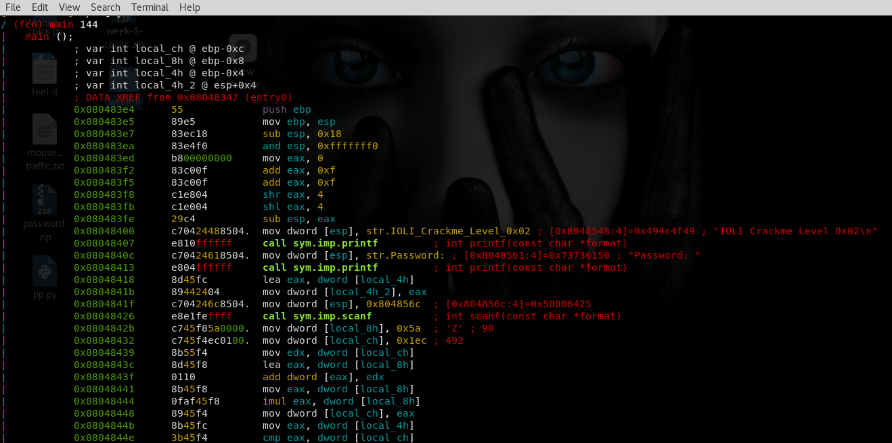
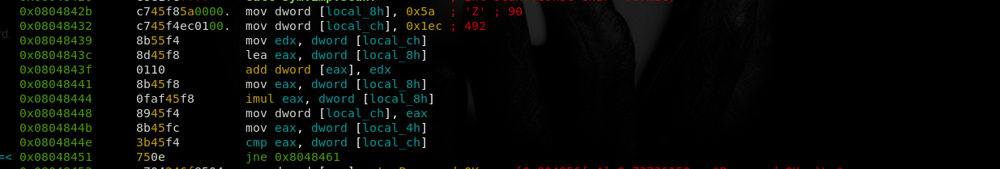
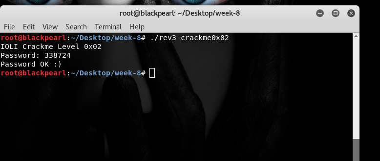

# Rev-3

## The Challenge

Here's the challenge task from the reversing category.We have to find the correct password and check if ok then password is our flag.

Now let's see the code of file using radare2.Make sure that file is executable.

(images/3.png)

We have to focus on only these instruction.

I see that at `0x0804844e` cmp instruction is used so, it may be compare with input.
I follow the instruction step by step and calculate the value at cmp instruction which is `33874`.

So, let check whether it's correct or not.

