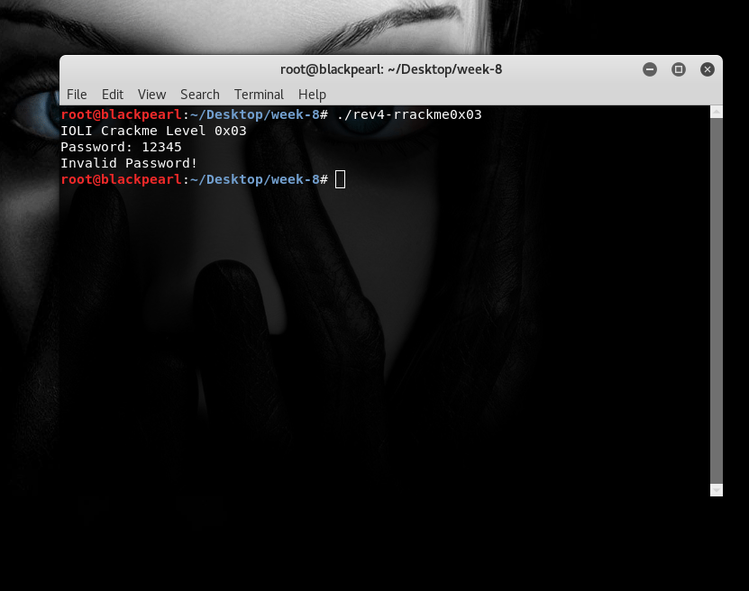
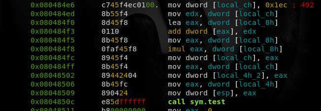
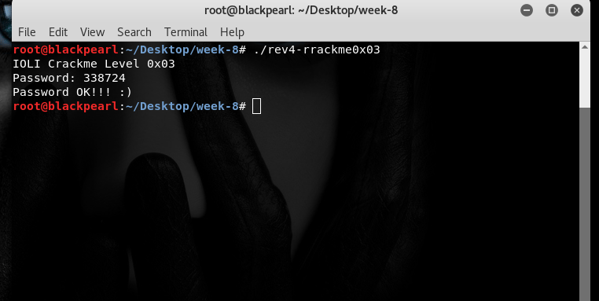

# Rev-4

## The Challenge

Here's the challenge task from the reversing category.We have to find the correct password and check if ok then password is our flag.

Now let's see the code of file using radare2.Make sure that file is executable.

We have to focus on only these instruction.

I see that at `0x0804850c` sym.test function call after calculation value of eax so,I do some calculations on instruction step by step and finally i found value of `eax` which is `0x52b24`(`338724` in decimal).

I check `338724` as password for this level and got positive output.

